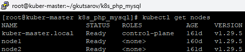
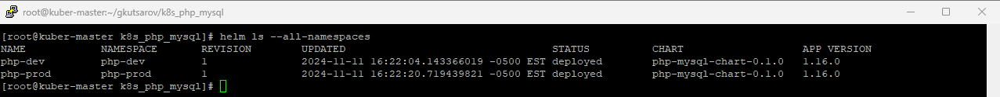
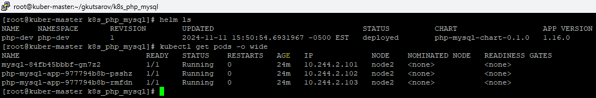
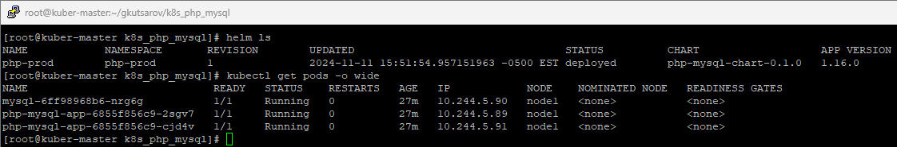

# Kubernetes PHP and MySQL Deployment

This project demonstrates deploying a PHP application with a MySQL backend on a local Kubernetes (K8s) cluster, which includes one master and two worker (slave) nodes. The setup uses Kubernetes resources to manage the deployment of PHP and MySQL containers, along with persistent storage for MySQL data.

Table of Contents
Project Overview
Prerequisites
Setup and Installation
Deployment Steps
Verifying the Deployment
Project Structure
Troubleshooting

# Project Overview

This project is a basic setup of a PHP application with a MySQL database, managed on a local Kubernetes cluster. The PHP container connects to the MySQL database service, allowing you to deploy a full LAMP-like stack within your Kubernetes environment.

# Key Features:

- **PHP Application**: Serves a simple application connecting to MySQL.
- **MySQL Database**: Managed with Persistent Volume (PV) and Persistent Volume Claim (PVC) for data persistence.
- **Multi-node Compatibility**: Designed to run on a Kubernetes cluster with a master and multiple worker nodes.
- **ConfigMaps for Configuration**: Uses ConfigMaps to pass environment variables and initialization data to MySQL and PHP containers.
- **Internal Networking**: Uses Kubernetes Services to allow the PHP app to communicate with MySQL within the cluster.

# Prerequisites

Before starting, ensure you have the following:

- **Kubernetes Cluster**: A local Kubernetes cluster with at least 1 master and 2 worker nodes.
- **kubectl**: The Kubernetes command-line tool installed and configured to interact with your local cluster.
- **Docker**: To build custom Docker images if needed.
- **Persistent Storage on Worker Nodes**: Ensure /var/lib/mysql is created on each worker node to hold the MySQL data.

# Setup and Installation

1. Clone the Repository:

```bash
git clone https://github.com/gkutsarov/k8s_php_mysql.git
cd k8s_php_mysql
```
2. Ensure MySQL Storage Path:

SSH into each worker node and create the directory /var/lib/mysql to store MySQL data.

```bash
ssh worker-node-1 (adjust name or IP address of your node)
sudo mkdir -p /var/lib/mysql
```
3. Edit Configuration Files (optional):

Customize any YAML files if specific values need modification for your environment (e.g., MySQL username, password, or PHP application specifics).

# Deployment Steps

To deploy the PHP and MySQL services to the Kubernetes cluster, follow the order below:

1. ConfigMaps:

Create the ConfigMap for MySQL initialization and configuration data. These provide essential environment variables and scripts for the MySQL and PHP deployments.
```bash
kubectl apply -f configmap-mysql-init.yaml
kubectl apply -f configmap.yaml
```

2. Persistent Volume (PV) and Persistent Volume Claim (PVC):

Create the Persistent Volume and Persistent Volume Claim for the MySQL database to ensure data persists across pod restarts.

```bash
kubectl apply -f mysql-pv.yaml
kubectl apply -f mysql-pvc.yaml
```

3. MySQL Service:

Deploy the mysql-service to allow the PHP application to connect to MySQL by an internal DNS name.

```bash
kubectl apply -f mysql-service.yaml
```

4. MySQL Deployment:

Deploy the MySQL database, which will use the PVC for persistent storage and the configmap-mysql-init.yaml ConfigMap for initialization data.

```bash
kubectl apply -f mysql-deployment.yaml
```

5. PHP Application Service:

Deploy the php-app-service to expose the PHP application within the cluster and, if needed, externally.

```bash
kubectl apply -f php-app-service.yaml
```

6. PHP Application Deployment:

Deploy the PHP application, which connects to the MySQL service using the mysql-service DNS name and uses configmap.yaml for configuration data.

```bash
kubectl apply -f php-deployment.yaml
```

7. Deploy NodePort service to be able to access the application locally from your localhost.

```bash
kubectl apply -f node-port.yaml
```

Access the application by navigating to `http://<Node_IP>:<NodePort>`

# Helm Chart

HELM simplifies managing complex Kubernetes applications by allowing you to packag, configure, deploy and upgrade applications consistently.

In this project (not so complex) I have used HELM to create two environments **dev** and **prod** each in separate namespace and to run on specific nodes.

First we need to create the K8S namespaces
```bash
kubectl create namespace php-prod
kubectl create namespace php-dev
```

Then we can proceed to install both HELM charts using different value files.
```bash
helm install php-prod php-mysql-chart/ --values php-mysql-chart/values-prod.yaml --namespace=php-prod
helm install php-dev php-mysql-chart/ --values php-mysql-chart/values-dev.yaml --namespace=php-dev
```







# Verifying the Deployment

1. Check Pod Status:

Run **kubectl get pods** to ensure all pods are running without issues.

2. View Logs:

Use **kubectl logs <pod-name>** to view logs for debugging any potential issues, especially useful for the PHP application or MySQL connection errors.

# Project Structure

Here’s a breakdown of the key files in this repository:

- **configmap-mysql-init.yaml**: ConfigMap for MySQL initialization data, such as scripts or environment variables.
- **configmap.yaml**: General ConfigMap for the PHP application configuration.
- **mysql-pv.yaml**: Defines the Persistent Volume for MySQL data storage.
- **mysql-pvc.yaml**: Defines the Persistent Volume Claim, linking MySQL to the PV.
- **mysql-deployment.yaml**: Defines the MySQL deployment.
- **mysql-service.yaml**: Defines the Service for MySQL, allowing internal communication for the PHP application.
- **php-deployment.yaml**: Defines the PHP application deployment.
- **php-app-service.yaml**: Defines the Service for the PHP application, allowing internal and/or external access.

# Troubleshooting

- **Storage Permission Issues**: If MySQL encounters permission issues, check the /var/lib/mysql directory permissions on each node and ensure Kubernetes has the correct permissions to access it.
- **Connection Errors**: If the PHP application can’t connect to MySQL, double-check the mysql-service.yaml and php-deployment.yaml configurations for consistent service names and environment variables (e.g., MySQL host, username, password).
- **Pod Failures**: Use kubectl describe pod <pod-name> to view detailed information on any failing pods for specific error messages.
